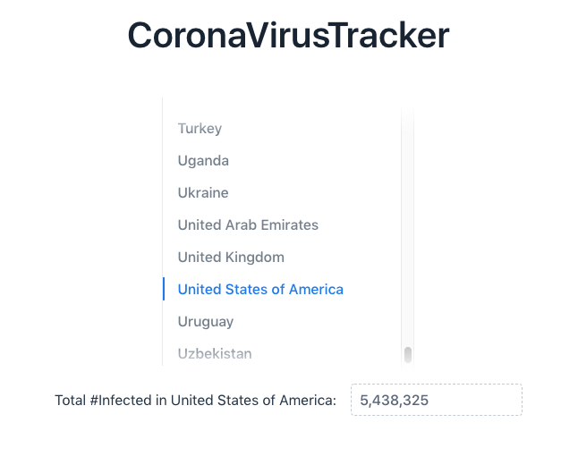

# CoronaVirusTracker
Small Project involving the use of Vaadin libraries and an coronavirus api

- Displays all countries provided by the conronavirus api and total #infected for each country
- When ran use http://localhost:8080/view to access

- data retrieved from: https://api.covid19api.com/summary
